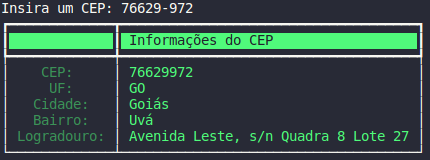
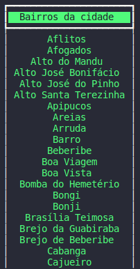

<!--- # Requisição de CEP, Rua, Cidade e Estados --->

<p>
    API Client criado para visualizar informações referentes a dados de localização. O objetivo é praticar diversos conceitos da linguagem e padrões de projeto. O padrão de projeto escolhido para o desenvolvimento é o <b>MVC (Model-View-Controller)</b>, implementado em Python.
</p>

<p>
    A API utilizada neste projeto foi a <a href="http://cep.la">cep.la</a>, que disponibiliza acesso gratuito e sem registro. Nessa API é possível solicitar dados de CEP de forma simples, com requisições *GET*, para recuperar dados de diferentes formas. É possível verificar dados referentes às cidades, bairros, ruas, cep's entre outros. Sua versatilidade de identificar todos esses campos através dos nomes que o usuário pode requisitar, faz com que seja possível desenvolver diversas funcionalidades.
</p>

---


## CepModel

<p>
    A implementação do *CepModel* consiste em realizar as requisições para a API, além de tratar os dados inseridos pelo usuário e retornar os dados de resposta da API, de uma maneira que possa ser utilizada por outras estruturas. Além disso, lança *exceções* para diversos problemas que podem ocorrer no processo, seja pelo usuário ou pela API.
</p>

## CepView

<p>
    A implementação do *CepView* consiste apenas em organizar a visualização dos dados retornados pelo *CepModel*. A visualização deve ser feita de forma clara para o usuário, a fim de oferecer uma experiência boa para quem utiliza. No momento é feita através de prints no terminal, porém a forma como o projeto está organizado permite que, caso o projeto escale e seja feita uma interface gráfica, por exemplo, os únicos métodos que deveriam ser modificadas seriam as de *CepView*. 
</p>

## CepController

<p>
    A implementação do *CepControl* é feita para que o usuário tenha acesso aos métodos para o uso da API como um cliente. Estes métodos coletam os dados necessários do usuário, invoca o *model* para tratá-los e organizar os dados, depois utiliza esses resultados para invocar o *view* e exibir os dados para o usuário. Essa orquestração é feita apenas pelo *controller*, ao qual o usuário tem contato. Nele também são feitos os tratamentos de exceção, simplificando ainda mais o retorno para o usuário verificar e realizar ações a respeito.
</p>

---


<p>
    Aqui serão apresentadas as próximas ideias a serem implementadas para que o projeto tenha cada vez mais funcionalidades.
</p>

- [x] Procura informações de endereço através de um CEP
- [x] Procura nomes dos bairros de cidades
- [ ] Descobrir CEP através de um endereço
- [ ] Descobrir se uma cidade, de um determinado estado possui distritos
- [ ] Listar Ruas de algum bairro da cidade
- [ ] Etc... (To-Do)

---


## 1. Procura informações de endereço através de um CEP

> main.py

```python
from CepControl import CepControl

if __name__ == '__main__':
    control = CepControl()
    control.search_by_cep(input('Insira um CEP válido: '))
```
> TERMINAL



## 2. Procura nomes dos bairros de cidades

> main.py

```python
from CepControl import CepControl

if __name__ == '__main__':
    control = CepControl()
    control.search_by_neighborhood(uf='pe', city='recife')
```

> TERMINAL (apenas parte da saída na imagem)

